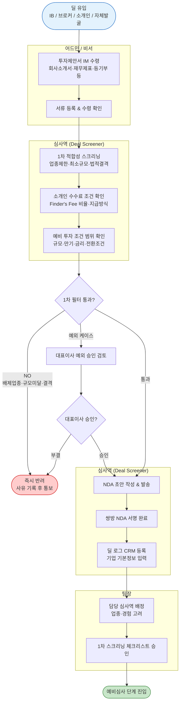
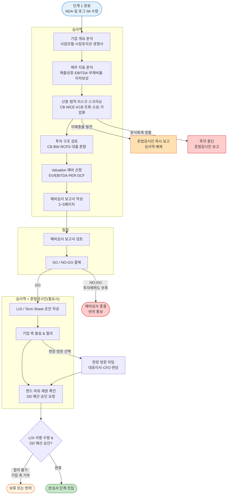
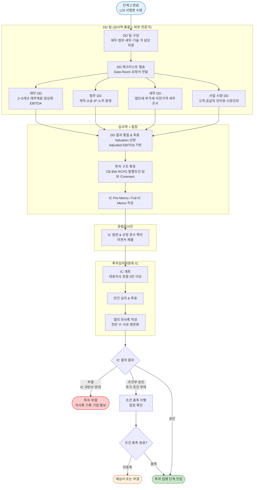
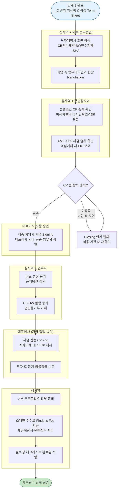
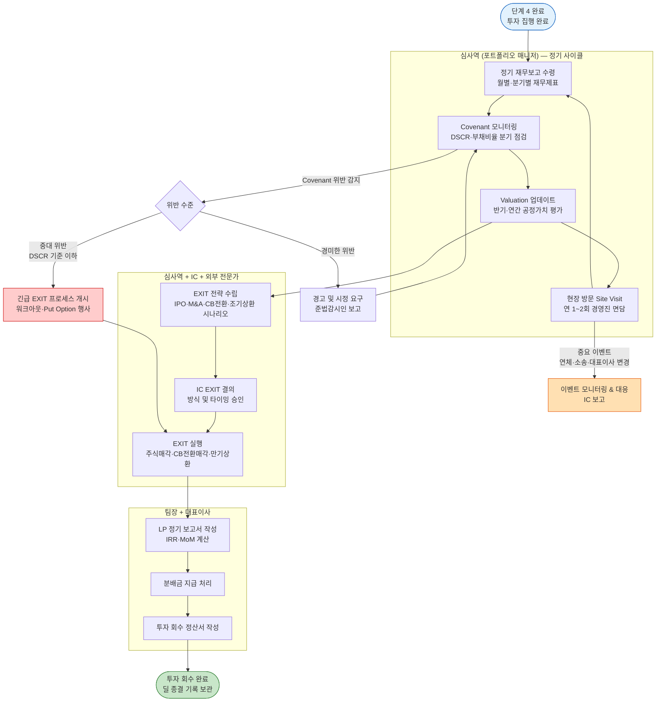
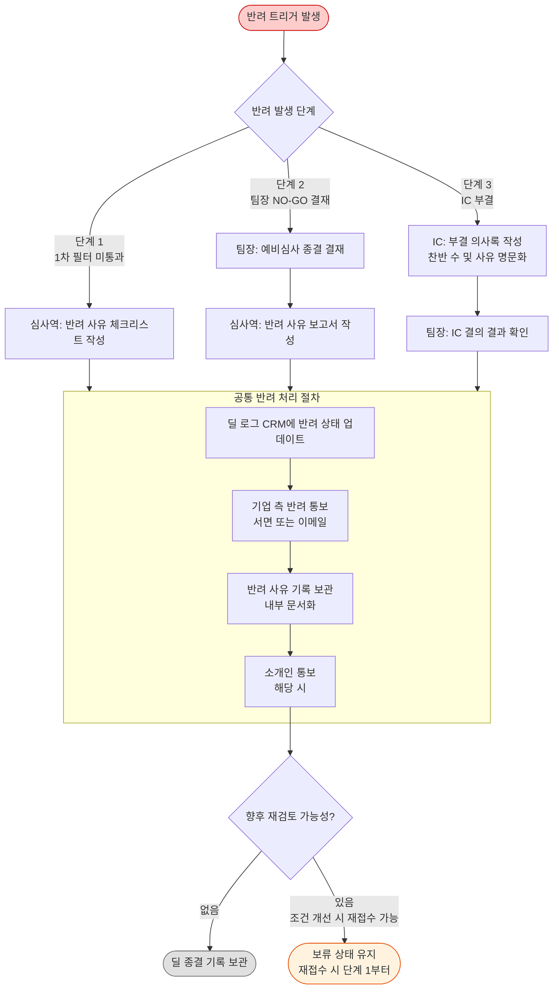
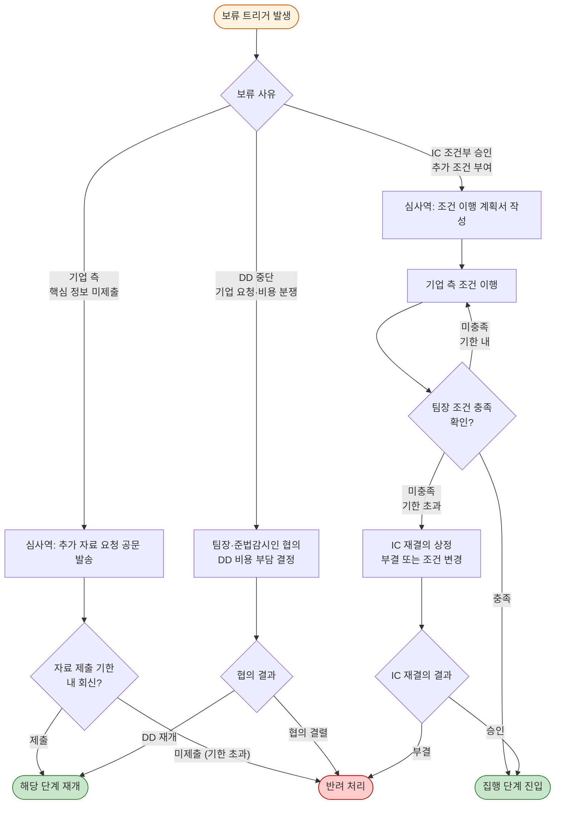
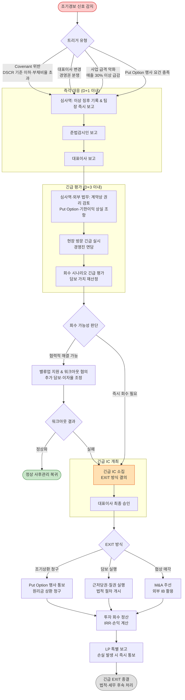

# 02. 투자 프로세스 플로차트 — SMB투자파트너스

> **면책 문구**: 본 문서는 내부 업무 가이드이며 법적 효력을 갖지 않음.
> **작성 기준**: `01_document_analysis.md` 기반 초안. 모든 항목 **[현장 검증 필요]**.
> **작성일**: 2026-06-25 | **문서 버전**: v0.1 (초안)

---

## 1. Level 0 — 전체 투자 프로세스 맵

> SMB투자파트너스 5단계 투자 전 과정 고수준 개요도. GO/NO-GO 분기 및 반려·보류 경로 포함.

```mermaid
flowchart TD
    START([딜 유입\nIB·브로커·자체발굴]) --> S1

    subgraph S1["① 투자요청 접수\n1~5 영업일"]
        A1[IM·재무제표 수령]
        A2[1차 적합성 필터링]
        A3[NDA 체결]
        A4[딜 로그 등록 & 심사역 배정]
        A1 --> A2 --> A3 --> A4
    end

    A4 --> DEC1{GO / NO-GO\n팀장 승인}
    DEC1 -- "NO-GO\n즉시 반려" --> REJ1([반려 통보\n사유 기록])
    DEC1 -- "예외\n대표이사 승인" --> S2
    DEC1 -- GO --> S2

    subgraph S2["② 예비심사\n5~17 영업일"]
        B1[재무·신용 분석]
        B2[Valuation 예비 산정]
        B3[예비심사 보고서 작성]
        B4[팀장 보고]
        B5[LOI / Term Sheet 발송]
        B1 --> B2 --> B3 --> B4 --> B5
    end

    B5 --> DEC2{GO / NO-GO\n팀장 결재}
    DEC2 -- "NO-GO\n예비심사 종결" --> REJ2([반려 또는 보류])
    DEC2 -- GO --> S3

    subgraph S3["③ 본심사 — DD & IC\n4~8주"]
        C1[DD 팀 구성 & Data Room 요청]
        C2[재무·법무·세무·사업 DD]
        C3[최종 Valuation & 투자구조 확정]
        C4[IC Memo 작성]
        C5[IC 투자심의위원회 개최]
        C1 --> C2 --> C3 --> C4 --> C5
    end

    C5 --> DEC3{IC 결의\n과반수 찬성}
    DEC3 -- "부결" --> REJ3([투자 부결\n의사록 기록])
    DEC3 -- "조건부 승인" --> COND[조건 충족 확인\n팀장 재확인]
    COND --> S4
    DEC3 -- "승인" --> S4

    subgraph S4["④ 투자 집행 — Closing\n2~6주"]
        D1[투자계약서 초안 & 협상]
        D2[선행조건CP 충족 확인]
        D3[계약서 서명 Signing]
        D4[담보 설정 등기]
        D5[자금 집행 Closing]
        D6[사후 등기·공시 & 장부 등록]
        D1 --> D2 --> D3 --> D4 --> D5 --> D6
    end

    D6 --> DEC4{클로징 체크리스트\n전 항목 완료?}
    DEC4 -- "미완료" --> D2
    DEC4 -- "완료" --> S5

    subgraph S5["⑤ 사후관리 & EXIT\n통상 3~7년"]
        E1[정기 재무보고 수령]
        E2[Covenant 모니터링]
        E3[Valuation 업데이트]
        E4[이벤트 모니터링]
        E5[EXIT 전략 수립]
        E6[EXIT 실행]
        E1 --> E2 --> E3 --> E4 --> E5 --> E6
    end

    E4 -- "Covenant 위반\n조기경보" --> EMRG[긴급 EXIT\n워크아웃·Put Option]
    E6 --> END([투자 회수 완료\nLP 정산 & 성과 보고])
    EMRG --> END

    style REJ1 fill:#ffcccc,stroke:#cc0000
    style REJ2 fill:#ffcccc,stroke:#cc0000
    style REJ3 fill:#ffcccc,stroke:#cc0000
    style EMRG fill:#ffe0b2,stroke:#e65100
    style END fill:#c8e6c9,stroke:#2e7d32
    style START fill:#e3f2fd,stroke:#1565c0
```

---

## 2. Level 1 — 단계별 상세 플로차트

### 2-1. 단계 1: 투자요청 접수 (Deal Sourcing & Intake)

**산출 문서**: NDA 체결본 / 딜 접수 등록 시트 / 1차 스크리닝 체크리스트
**소요기간**: 접수~NDA 체결 1~3 영업일 / 접수~담당자 배정 3~5 영업일

---

### 2-2. 단계 2: 예비심사 (Preliminary Review)

**산출 문서**: 예비심사 보고서 / 재무 분석 워크시트(Excel) / LOI·Term Sheet 초안 / GO/NO-GO 결재 기록
**소요기간**: 자료 수집~예비심사 보고서 5~10 영업일 / LOI 발송~기업 회신 3~7 영업일

---

### 2-3. 단계 3: 본심사 — 실사(DD) 및 IC 결의

**산출 문서**: DD 결과 요약 보고서 / IC Pre-Memo·Full IC Memo / IC 결의 의사록 / 확정 Term Sheet
**소요기간**: DD 착수~완료 2~6주 / IC 자료 작성~IC 개최 3~7 영업일 / 전체 4~8주

---

### 2-4. 단계 4: 투자 집행 (Closing)

**산출 문서**: 투자계약서 서명본 / 근저당권·질권 설정 등기필증 / CB·BW 증권 원본 / 자금 집행 확인서 / 클로징 체크리스트 완료본
**소요기간**: 계약서 초안~서명 2~4주 / 서명~자금 집행 3~10 영업일

---

### 2-5. 단계 5: 사후관리 (Portfolio Monitoring & EXIT)

**산출 문서**: 포트폴리오 모니터링 보고서(분기) / Covenant 점검표(분기) / Valuation 업데이트 보고서(반기) / EXIT 검토 보고서 / LP 정기 보고서 / 투자 회수 정산서
**소요기간**: 모니터링 주기 월 1회(재무) / 분기 1회(Covenant) / EXIT 준비~완료 3개월~1년 이상

---

## 3. RACI 매트릭스

> 역할 정의: **심사역** = 담당 심사역(Deal Screener·포트폴리오 매니저) / **팀장** = 투자팀장 / **IC** = 투자심의위원회 / **준법** = 준법감시인 / **대표** = 대표이사 / **외부** = 외부 법무·회계·세무 전문가
>
> **R** = Responsible(실행) | **A** = Accountable(책임) | **C** = Consulted(자문) | **I** = Informed(통보)

| # | 주요 활동 | 심사역 | 팀장 | IC | 준법 | 대표 | 외부 |
|---|----------|:------:|:----:|:--:|:----:|:----:|:----:|
| **[단계 1] 투자요청 접수** |
| 1-1 | 딜 소싱 채널 관리 | R | A | - | I | I | - |
| 1-2 | IM·재무제표 등 서류 수령 | R | A | - | - | - | - |
| 1-3 | 1차 적합성 필터링 | R | A | - | C | - | - |
| 1-4 | NDA 체결 | R | A | - | C | I | - |
| 1-5 | 딜 로그 CRM 등록 | R | A | - | - | - | - |
| 1-6 | 담당 심사역 배정 | C | R/A | - | - | I | - |
| 1-7 | 소개인 수수료 조건 확인 | R | A | - | C | I | - |
| **[단계 2] 예비심사** |
| 2-1 | 재무 지표 분석 | R | C | - | - | - | C |
| 2-2 | 신용·법적 리스크 스크리닝 | R | C | - | C | - | C |
| 2-3 | 투자 구조 검토 | R | C | - | C | - | C |
| 2-4 | Valuation 예비 산정 | R | C | I | - | - | C |
| 2-5 | 예비심사 보고서 작성 | R | A | - | - | - | - |
| 2-6 | 팀장 GO/NO-GO 결재 | C | R/A | I | C | - | - |
| 2-7 | LOI / Term Sheet 초안 작성 | R | A | - | C | - | C |
| 2-8 | 펀드 여유 재원 확인 | C | R | I | - | A | - |
| 2-9 | DD 예산 승인 요청 | R | C | - | - | A | - |
| **[단계 3] 본심사 — DD & IC** |
| 3-1 | DD 팀 구성 | R | A | I | C | - | C |
| 3-2 | 재무 DD | R | C | I | - | - | R/C |
| 3-3 | 법무 DD | R | C | I | C | - | R |
| 3-4 | 세무 DD | R | C | I | - | - | R |
| 3-5 | 사업·시장 DD | R | C | I | - | - | C |
| 3-6 | 최종 Valuation 산정 | R | C | C | - | - | C |
| 3-7 | 투자 구조 확정 | R | A | C | C | - | C |
| 3-8 | IC Memo 작성 | R | A | - | - | - | - |
| 3-9 | IC 개최 및 안건 심의 | C | C | R/A | C | R | - |
| 3-10 | IC 결의 의사록 작성 | C | C | R/A | C | I | - |
| 3-11 | 투자 조건부 승인 조건 이행 확인 | R | A | I | C | - | - |
| **[단계 4] 투자 집행** |
| 4-1 | 투자계약서 초안 작성 | R | C | - | C | - | R |
| 4-2 | 계약 협상 | R | A | I | C | - | R |
| 4-3 | 선행조건 CP 충족 확인 | R | A | - | C | - | C |
| 4-4 | AML·KYC 자금 출처 확인 | R | C | - | R/A | - | - |
| 4-5 | 최종 계약서 서명 Signing | R | A | I | C | R/A | C |
| 4-6 | 담보 설정 등기 | R | C | - | C | - | R |
| 4-7 | CB·BW 발행 등기 | R | C | I | C | - | R |
| 4-8 | 자금 집행 Closing | R | A | I | C | R/A | - |
| 4-9 | 내부 포트폴리오 장부 등록 | R | A | I | - | - | - |
| 4-10 | 소개인 수수료 지급 | R | A | - | C | I | - |
| **[단계 5] 사후관리 & EXIT** |
| 5-1 | 정기 재무보고 수령 & 검토 | R | I | - | - | - | - |
| 5-2 | Covenant 모니터링 | R | A | I | C | - | - |
| 5-3 | Valuation 업데이트 | R | A | I | - | - | R |
| 5-4 | 현장 방문 Site Visit | R | C | - | - | I | - |
| 5-5 | 이벤트 모니터링 & 이상징후 대응 | R | A | C | C | I | - |
| 5-6 | Covenant 위반 대응 | R | A | C | R/C | I | C |
| 5-7 | EXIT 전략 수립 | R | A | C | C | I | C |
| 5-8 | EXIT IC 결의 | C | C | R/A | C | R | - |
| 5-9 | EXIT 실행 | R | A | I | C | I | R |
| 5-10 | LP 정기 보고서 작성 | R | A | I | C | R/A | - |
| 5-11 | 투자 회수 정산서 작성 | R | A | I | C | I | C |

---

## 4. 예외 흐름 다이어그램

### 4-1. 투자 반려 프로세스

---

### 4-2. 보류 / 재심사 프로세스

---

### 4-3. 긴급 EXIT 프로세스

---

## 5. 참고: 단계별 소요기간 요약

| 단계 | 최단 | 일반 | 최장 |
|------|------|------|------|
| ① 투자요청 접수 | 1 영업일 | 3~5 영업일 | 10 영업일 |
| ② 예비심사 | 5 영업일 | 10~17 영업일 | 4주 |
| ③ 본심사 — DD & IC | 2주 | 4~6주 | 8주 |
| ④ 투자 집행 | 3주 | 4~6주 | 3개월 |
| ⑤ 사후관리 (투자기간) | 1년 | 3~5년 | 7년 이상 |
| **① ~ ④ 접수~클로징** | **6주** | **12~16주** | **6개월 이상** |

---

## 6. 다이어그램 렌더링 안내

- 본 문서의 Mermaid 코드는 **Mermaid v10+** 기준으로 작성됨.
- 렌더링 환경: GitHub Markdown / Obsidian (Mermaid 플러그인) / VS Code (Markdown Preview Mermaid Support) / [mermaid.live](https://mermaid.live)
- 단일 다이어그램 노드 수: Level 0 = 20개 이하 / Level 1 각 단계 = 15~18개 수준으로 복잡도 관리.
- `subgraph` 레이블에 줄바꿈이 포함된 경우 일부 렌더러에서 `\n` 대신 실제 줄바꿈이 필요할 수 있음 **[렌더러 호환성 현장 검증 필요]**.

---

*본 문서는 `01_document_analysis.md` 기반으로 작성된 초안입니다. 모든 플로차트 및 RACI는 SMB투자파트너스 현장 실무진 검토 후 수정·확정되어야 합니다.*
*면책 문구: 본 매뉴얼은 내부 업무 가이드이며 법적 효력을 갖지 않음.*
